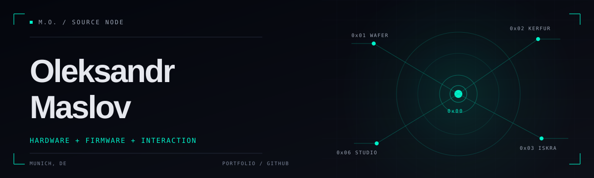

I build the device. Then the firmware. Then the tools that put it in someone’s hands.

I’m a product-minded designer and embedded developer in Munich. My work crosses custom hardware, Zephyr firmware, interfaces, and the tools around them.

### Selected work

- `0x01` **[Wafer](https://oleksandrmaslov.github.io/portfolio/Wafer.html)** — A 36-key wireless split keyboard built around a custom PCB, a thin aluminium enclosure, and ZMK firmware. [Repository](https://github.com/oleksandrmaslov/wafer-zmk-config)
- `0x02` **[Kerfur](https://oleksandrmaslov.github.io/portfolio/Kerfur.html)** — An embedded companion with an animated face, motion sensing, BLE, and event-driven Zephyr firmware. [Repository](https://github.com/oleksandrmaslov/kerfur-zephyr-config)
- `0x03` **[Iskra](https://oleksandrmaslov.github.io/portfolio/Iskra.html)** — A guided ARM Cortex-M flashing workflow with signed firmware checks and an audit trail. [Repository](https://github.com/oleksandrmaslov/iskra)
- `0x06` **[Wafer Studio](https://oleksandrmaslov.github.io/portfolio/Wafer%20Studio.html)** — A visual keymap editor for ZMK Studio keyboards. [Try it](https://oleksandrmaslov.github.io/wafer-studio/) · [Repository](https://github.com/oleksandrmaslov/wafer-studio)
- `0x07` **[Split HID Display](https://oleksandrmaslov.github.io/portfolio/Split%20HID%20Display.html)** — A ZMK module that carries host status and media information across both halves of a split keyboard. [Repository](https://github.com/oleksandrmaslov/zmk-split-hid-display)

### Explore further

[Portfolio](https://oleksandrmaslov.github.io/portfolio/) · [All projects](https://oleksandrmaslov.github.io/portfolio/All%20Projects.html) · [Email](mailto:oleksandrmaslov08@gmail.com)
